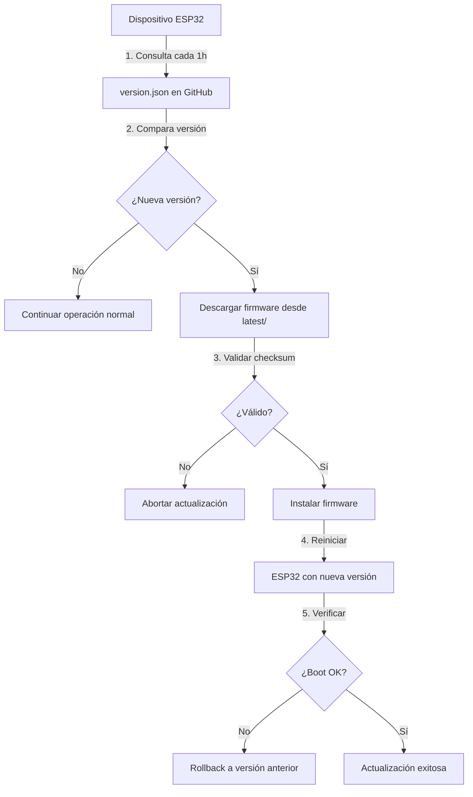

# AQUADATA-OTA 🌊

[](https://github.com/GrupoERE/AQUADATA-OTA)
[](https://github.com/GrupoERE/AQUADATA-OTA)
[](https://www.espressif.com/)

Sistema de actualización remota Over-The-Air (OTA) para dispositivos AQUADATA ESP32. Permite actualizar el firmware de los dispositivos de campo sin necesidad de conexión física, mejorando el mantenimiento y despliegue de nuevas funcionalidades.

---

## 📌 ¿Qué es AQUADATA-OTA?

Este repositorio gestiona las actualizaciones remotas del firmware AQUADATA, permitiendo:

- ✅ **Actualizaciones remotas**: Sin acceso físico a los dispositivos
- ✅ **Control de versiones**: Gestión centralizada de releases
- ✅ **Rollback seguro**: Versiones anteriores disponibles
- ✅ **Validación automática**: Checksum y verificación de integridad
- ✅ **Actualización programada**: Horarios específicos o inmediatos
- ✅ **Monitoreo de versiones**: Seguimiento de dispositivos actualizados

---

## 📁 Estructura del Repositorio

```
AQUADATA-OTA/
│
├── firmware/                    # Archivos binarios compilados
│   ├── v1.11.0/                # Versión actual estable
│   │   ├── aquadata_v1.11.0.bin
│   │   ├── CHANGELOG.md
│   │   └── checksum.txt
│   │
│   ├── v1.10.0/                # Versiones anteriores (rollback)
│   │   └── aquadata_v1.10.0.bin
│   │
│   ├── beta/                   # Versiones en prueba
│   │   └── aquadata_v1.12.0-beta.bin
│   │
│   └── latest/                 # Última versión estable (siempre actualizado)
│       ├── aquadata_latest.bin
│       └── checksum.txt
│
├── config/
│   ├── version.json            # Configuración de versiones
│   └── update_schedule.json    # Programación de actualizaciones
│
├── scripts/                    # Herramientas auxiliares
│   ├── generate_checksum.py   # Generar hash del firmware
│   └── deploy_ota.sh          # Script de despliegue
│
├── docs/
│   ├── OTA_PROTOCOL.md        # Documentación técnica del protocolo
│   └── DEPLOYMENT_GUIDE.md    # Guía de despliegue
│
└── README.md                   # Este archivo
```

---

## 🚀 Inicio Rápido

### Para Desarrolladores

#### 1. **Compilar firmware**
```bash
# Desde PlatformIO
pio run --environment esp32dev

# El archivo .bin se genera en:
# .pio/build/esp32dev/firmware.bin
```

#### 2. **Preparar nueva versión**
```bash
# Crear carpeta de versión
mkdir firmware/v1.12.0

# Copiar el binario compilado
cp .pio/build/esp32dev/firmware.bin firmware/v1.12.0/aquadata_v1.12.0.bin

# Generar checksum
sha256sum firmware/v1.12.0/aquadata_v1.12.0.bin > firmware/v1.12.0/checksum.txt
```

#### 3. **Actualizar version.json**
```json
{
  "latest_version": "1.12.0",
  "firmware_url": "https://raw.githubusercontent.com/GrupoERE/AQUADATA-OTA/main/firmware/latest/aquadata_latest.bin",
  "changelog": "Añadido soporte para sensor de conductividad",
  "mandatory": false,
  "min_version": "1.10.0",
  "release_date": "2024-10-05",
  "file_size_kb": 892,
  "checksum_sha256": "a3f2b8c9d1e4f5a6b7c8d9e0f1a2b3c4d5e6f7a8b9c0d1e2f3a4b5c6d7e8f9a0"
}
```

#### 4. **Copiar a latest/**
```bash
# Actualizar latest con la nueva versión
cp firmware/v1.12.0/aquadata_v1.12.0.bin firmware/latest/aquadata_latest.bin
cp firmware/v1.12.0/checksum.txt firmware/latest/
```

#### 5. **Commit y push**
```bash
git add .
git commit -m "Release: v1.12.0 - Nuevo sensor de conductividad"
git push origin main
```

---

## 🔄 Flujo de Actualización OTA



### Proceso Detallado:

1. **Verificación periódica** (cada 1 hora)
   - ESP32 consulta `version.json` vía HTTPS
   - Compara versión local vs. remota

2. **Descarga condicional**
   - Solo descarga si hay nueva versión
   - Verifica espacio disponible en flash

3. **Validación de integridad**
   - Calcula SHA256 del archivo descargado
   - Compara con checksum en `version.json`

4. **Instalación segura**
   - Guarda versión actual como backup
   - Escribe nuevo firmware en partición OTA
   - Marca partición como válida

5. **Verificación post-actualización**
   - Reinicio automático
   - Si falla el boot 3 veces → rollback automático
   - Envía estado de actualización por MQTT

---

## 📋 Formato del archivo version.json

```json
{
  "latest_version": "1.11.0",
  "firmware_url": "https://raw.githubusercontent.com/GrupoERE/AQUADATA-OTA/main/firmware/latest/aquadata_latest.bin",
  "changelog": "Fix bootloop watchdog + Optimización OTA",
  "mandatory": false,
  "min_version": "1.8.0",
  "release_date": "2024-10-05",
  "release_time": "14:30:00",
  "file_size_kb": 876,
  "checksum_sha256": "a3f2b8c9d1e4f5a6b7c8d9e0f1a2b3c4d5e6f7a8b9c0d1e2f3a4b5c6d7e8f9a0",
  "download_url_backup": "https://backup-server.com/aquadata_latest.bin",
  "rollback_enabled": true,
  "features": [
    "Watchdog timer mejorado",
    "Corrección de altitud optimizada",
    "OTA más estable"
  ],
  "breaking_changes": false,
  "estimated_update_time_sec": 45
}
```

### Campos:

| Campo | Tipo | Descripción |
|-------|------|-------------|
| `latest_version` | string | Versión más reciente disponible |
| `firmware_url` | string | URL directa del archivo .bin |
| `changelog` | string | Descripción breve de cambios |
| `mandatory` | boolean | Si es obligatoria la actualización |
| `min_version` | string | Versión mínima compatible |
| `release_date` | string | Fecha de publicación (YYYY-MM-DD) |
| `file_size_kb` | integer | Tamaño del archivo en KB |
| `checksum_sha256` | string | Hash SHA256 del firmware |
| `rollback_enabled` | boolean | Permitir volver a versión anterior |
| `breaking_changes` | boolean | Si rompe compatibilidad |

---

## 📊 Versionado Semántico

Seguimos el estándar [SemVer 2.0.0](https://semver.org/):

```
v MAJOR . MINOR . PATCH

Ejemplo: v1.11.0
```

- **MAJOR** (1.x.x): Cambios incompatibles con versiones anteriores
- **MINOR** (x.11.x): Nueva funcionalidad compatible
- **PATCH** (x.x.0): Corrección de bugs

### Ejemplos:
- `v1.11.0` → `v1.11.1`: Bug fix (sin cambios de API)
- `v1.11.1` → `v1.12.0`: Nuevo sensor añadido (compatible)
- `v1.12.0` → `v2.0.0`: Cambio de protocolo MQTT (breaking change)

---

## ⚠️ Seguridad y Mejores Prácticas

### ✅ Checklist antes de Release:

- [ ] Código compilado sin errores ni warnings
- [ ] Probado en hardware real (mínimo 24h)
- [ ] Watchdog timer funcional
- [ ] Generado checksum SHA256
- [ ] Actualizado `version.json`
- [ ] Documentado en `CHANGELOG.md`
- [ ] Testeado proceso OTA completo
- [ ] Verificado rollback funcional
- [ ] Copiado a `latest/`

### 🔒 Seguridad:

- ✅ Usar HTTPS para descargas (GitHub Raw)
- ✅ Validar checksum SHA256 siempre
- ✅ Implementar rollback automático
- ✅ No actualizar con batería baja
- ✅ Logs detallados del proceso OTA
- ✅ Timeout de 60 segundos en descargas

### 📝 Nomenclatura de Archivos:

```
aquadata_v[VERSION].bin

Ejemplos:
✅ aquadata_v1.11.0.bin
✅ aquadata_v1.12.0-beta.bin
❌ firmware.bin (muy genérico)
❌ aquadata_final.bin (no versionado)
```

---

## 🛠️ Herramientas Auxiliares

### Generar Checksum (Linux/Mac):
```bash
sha256sum firmware/v1.11.0/aquadata_v1.11.0.bin
```

### Generar Checksum (Windows PowerShell):
```powershell
Get-FileHash firmware\v1.11.0\aquadata_v1.11.0.bin -Algorithm SHA256
```

### Verificar tamaño del firmware:
```bash
ls -lh firmware/v1.11.0/aquadata_v1.11.0.bin
```

---

## 📈 Historial de Versiones

| Versión | Fecha | Changelog | Tamaño | Estado |
|---------|-------|-----------|--------|--------|
| v1.11.0 | 2024-10-05 | Fix bootloop watchdog | 876 KB | ✅ Estable |
| v1.10.0 | 2024-09-28 | Mejoras BLE Manager | 865 KB | ✅ Estable |
| v1.9.0 | 2024-09-14 | Primera versión OTA | 842 KB | ⚠️ Deprecated |

Ver changelog completo: [CHANGELOG.md](./CHANGELOG.md)

---

## 🐛 Troubleshooting

### Problema: OTA falla al descargar
**Solución:**
- Verificar conectividad WiFi
- Confirmar URL en `version.json`
- Revisar espacio libre en flash

### Problema: Checksum no coincide
**Solución:**
- Re-generar checksum del .bin
- Verificar que el archivo no esté corrupto
- Comparar tamaño con `file_size_kb`

### Problema: Bootloop después de OTA
**Solución:**
- El sistema hará rollback automático después de 3 intentos
- Revisar logs del watchdog
- Probar firmware en hardware antes de release

---

## 📞 Soporte

- **Issues**: [GitHub Issues](https://github.com/GrupoERE/AQUADATA-OTA/issues)
- **Documentación**: [Wiki del proyecto](https://github.com/GrupoERE/AQUADATA-OTA/wiki)
- **Email**: soporte@grupoere.com

---

## 📄 Licencia

Copyright © 2024 Grupo ERE. Todos los derechos reservados.

---

## 🔗 Repositorios Relacionados

- [Aquadata-Esp32-firmware](https://github.com/GrupoERE/Aquadata-Esp32-firmware) - Código fuente del firmware
- [Aquadata-Dashboard](https://github.com/GrupoERE/Aquadata-Dashboard) - Panel de control web
- [Aquadata-Mobile](https://github.com/GrupoERE/Aquadata-Mobile) - App móvil de configuración

---

**Última actualización**: 2024-10-05  
**Mantenido por**: Grupo ERE - Equipo de Desarrollo IoT
