# AQUADATA-OTA 🌊

[](https://github.com/GrupoERE/AQUADATA-OTA)
[](https://github.com/GrupoERE/AQUADATA-OTA)
[](https://www.espressif.com/)

Sistema de actualización remota Over-The-Air (OTA) para dispositivos AQUADATA ESP32. Actualiza el firmware de dispositivos en campo sin conexión física, simplificando el mantenimiento y despliegue de nuevas funcionalidades.

---

## 📌 Características

- ✅ **Actualizaciones remotas** - Sin acceso físico al dispositivo
- ✅ **Control de versiones** - Gestión centralizada desde GitHub
- ✅ **Rollback automático** - Vuelve a versión anterior si falla el boot
- ✅ **Validación SHA256** - Verificación de integridad garantizada
- ✅ **Verificación periódica** - Consulta cada hora por actualizaciones
- ✅ **Monitoreo MQTT** - Reporte de estado de actualización

---

## 📁 Estructura del Repositorio

```
AQUADATA-OTA/
├── firmware/
│   ├── vX.X.X/                     # Carpeta por versión
│   │   ├── aquadata_vX.X.X.bin    # Binario compilado
│   │   ├── CHANGELOG.md           # Cambios de esta versión
│   │   └── checksum.txt           # Hash SHA256
│   │
│   ├── beta/                       # Versiones en prueba
│   │   └── aquadata_vX.X.X-beta.bin
│   │
│   └── latest/                     # Última versión estable
│       ├── aquadata_latest.bin    # ESP32 descarga desde aquí
│       └── checksum.txt
│
├── config/
│   ├── version.json                # ESP32 consulta este archivo
│   └── update_schedule.json        # Programación opcional
│
├── scripts/
│   ├── generate_checksum.py        # Genera hash SHA256
│   └── deploy_ota.sh               # Automatiza despliegue
│
├── docs/
│   ├── OTA_PROTOCOL.md             # Protocolo técnico
│   └── DEPLOYMENT_GUIDE.md         # Guía paso a paso
│
└── README.md
```

---

## 🚀 Proceso de Actualización

### Pasos Simples

1. **Reemplazar el archivo .bin** en `firmware/latest/aquadata_latest.bin`

2. **Actualizar version.json** con la nueva versión:
```json
{
  "latest_version": "1.12.0",
  "firmware_url": "https://raw.githubusercontent.com/GrupoERE/AQUADATA-OTA/main/firmware/latest/aquadata_latest.bin",
  "changelog": "Descripción de cambios",
  "mandatory": false,
  "min_version": "1.10.0",
  "release_date": "2024-10-05",
  "file_size_kb": 892,
  "checksum_sha256": "hash_del_archivo"
}
```

3. **Hacer commit y push** a GitHub

4. **Los dispositivos se actualizan automáticamente** en la siguiente verificación (cada minuto)

---

## 🔄 Flujo de Actualización

```mermaid
graph TD
    A[ESP32 en campo] -->|Consulta cada 1h| B[version.json]
    B -->|Compara versión| C{Nueva versión?}
    C -->|No| D[Continuar operación]
    C -->|Sí| E[Descargar firmware]
    E -->|Validar SHA256| F{Checksum válido?}
    F -->|No| G[Abortar]
    F -->|Sí| H[Instalar firmware]
    H -->|Reiniciar| I[ESP32 nueva versión]
    I -->|Verificar boot| J{Boot exitoso?}
    J -->|No - 3 intentos| K[Rollback automático]
    J -->|Sí| L[Actualización completa]
```



### Proceso Paso a Paso

1. **Verificación automática** (cada 1 hora)
   - ESP32 consulta `version.json` vía HTTPS
   - Compara versión local con remota

2. **Descarga condicional**
   - Descarga solo si hay nueva versión
   - Verifica espacio disponible en flash

3. **Validación de integridad**
   - Calcula SHA256 del archivo descargado
   - Compara con checksum en `version.json`

4. **Instalación segura**
   - Guarda versión actual como backup
   - Escribe firmware en partición OTA
   - Marca partición como válida

5. **Verificación post-actualización**
   - Reinicio automático
   - Rollback si falla boot 3 veces consecutivas
   - Envía estado vía MQTT

---

## 📋 Formato version.json

```json
{
  "latest_version": "1.11.0",
  "firmware_url": "https://raw.githubusercontent.com/GrupoERE/AQUADATA-OTA/main/firmware/latest/aquadata_latest.bin",
  "changelog": "Fix bootloop watchdog + Optimización OTA",
  "mandatory": false,
  "min_version": "1.8.0",
  "release_date": "2024-10-05",
  "file_size_kb": 876,
  "checksum_sha256": "a3f2b8c9d1e4f5a6b7c8d9e0f1a2b3c4d5e6f7a8b9c0d1e2f3a4b5c6d7e8f9a0",
  "rollback_enabled": true,
  "breaking_changes": false
}
```

### Campos Principales

| Campo | Tipo | Descripción |
|-------|------|-------------|
| `latest_version` | string | Versión más reciente (formato SemVer) |
| `firmware_url` | string | URL directa al archivo .bin |
| `changelog` | string | Descripción breve de cambios |
| `mandatory` | boolean | Si la actualización es obligatoria |
| `min_version` | string | Versión mínima compatible |
| `file_size_kb` | integer | Tamaño del firmware en KB |
| `checksum_sha256` | string | Hash SHA256 para validación |
| `rollback_enabled` | boolean | Permitir rollback si falla |
| `breaking_changes` | boolean | Si rompe compatibilidad |

---

## 📊 Versionado Semántico

Seguimos [SemVer 2.0.0](https://semver.org/):

```
vMAJOR.MINOR.PATCH
Ejemplo: v1.11.0
```

- **MAJOR** (1.x.x) - Cambios incompatibles
- **MINOR** (x.11.x) - Nueva funcionalidad compatible
- **PATCH** (x.x.0) - Corrección de bugs

### Ejemplos

- `v1.11.0` → `v1.11.1` - Bug fix menor
- `v1.11.1` → `v1.12.0` - Nuevo sensor (compatible)
- `v1.12.0` → `v2.0.0` - Cambio de protocolo (breaking)

---

## ⚠️ Checklist de Release

### Antes de Publicar

- [ ] Compilado sin errores ni warnings
- [ ] Probado en hardware real (mínimo 24h)
- [ ] Watchdog timer funcional
- [ ] Checksum SHA256 generado
- [ ] `version.json` actualizado
- [ ] `CHANGELOG.md` documentado
- [ ] Proceso OTA completo testeado
- [ ] Rollback verificado
- [ ] Copiado a carpeta `latest/`
- [ ] Git commit con mensaje descriptivo

### Seguridad

- ✅ Usar HTTPS para descargas (GitHub Raw)
- ✅ Validar checksum SHA256 obligatoriamente
- ✅ Implementar rollback automático
- ✅ No actualizar con batería baja
- ✅ Logs detallados del proceso
- ✅ Timeout de 60s en descargas

---

## 🛠️ Herramientas

### Generar Checksum

**Linux/Mac:**
```bash
sha256sum firmware/v1.11.0/aquadata_v1.11.0.bin
```

**Windows PowerShell:**
```powershell
Get-FileHash firmware\v1.11.0\aquadata_v1.11.0.bin -Algorithm SHA256
```

### Verificar Tamaño
```bash
ls -lh firmware/v1.11.0/aquadata_v1.11.0.bin
```

### Nomenclatura de Archivos
```
✅ aquadata_v1.11.0.bin
✅ aquadata_v1.12.0-beta.bin
❌ firmware.bin (muy genérico)
❌ aquadata_final.bin (no versionado)
```

---

## 📈 Historial de Versiones

| Versión | Fecha | Changelog | Tamaño | Estado |
|---------|-------|-----------|--------|--------|
| v1.11.0 | 2024-10-05 | Fix bootloop watchdog | 876 KB | ✅ Estable |
| v1.10.0 | 2024-09-28 | Mejoras BLE Manager | 865 KB | ✅ Estable |
| v1.9.0 | 2024-09-14 | Primera versión OTA | 842 KB | ⚠️ Obsoleta |

[Ver changelog completo →](./CHANGELOG.md)

---

## 🐛 Troubleshooting

### OTA falla al descargar
**Causas posibles:**
- WiFi inestable o sin conexión
- URL incorrecta en `version.json`
- Espacio insuficiente en flash

**Solución:**
```bash
# Verificar URL
curl -I https://raw.githubusercontent.com/GrupoERE/AQUADATA-OTA/main/firmware/latest/aquadata_latest.bin

# Verificar tamaño
ls -lh firmware/latest/aquadata_latest.bin
```

### Checksum no coincide
**Causas posibles:**
- Archivo corrupto durante descarga
- Checksum mal generado

**Solución:**
```bash
# Re-generar checksum
sha256sum firmware/v1.11.0/aquadata_v1.11.0.bin > firmware/v1.11.0/checksum.txt

# Comparar con version.json
cat firmware/v1.11.0/checksum.txt
```

### Bootloop después de OTA
**El sistema hace rollback automático tras 3 intentos fallidos**

**Prevención:**
- Probar firmware en hardware antes de publicar
- Revisar logs del watchdog
- Verificar funcionalidad del watchdog timer

---

## 📞 Soporte

- **Issues**: [GitHub Issues](https://github.com/GrupoERE/AQUADATA-OTA/issues)
- **Documentación**: [Wiki](https://github.com/GrupoERE/AQUADATA-OTA/wiki)
- **Email**: soporte@grupoere.com

---

## 🔗 Repositorios Relacionados

- [Aquadata-Esp32-firmware](https://github.com/GrupoERE/Aquadata-Esp32-firmware) - Código fuente
- [Aquadata-Dashboard](https://github.com/GrupoERE/Aquadata-Dashboard) - Panel web
- [Aquadata-Mobile](https://github.com/GrupoERE/Aquadata-Mobile) - App móvil

---

## 📄 Licencia

Copyright © 2024 Grupo ERE. Todos los derechos reservados.

---

**Última actualización**: 2024-10-05  
**Mantenedor**: Grupo ERE - Equipo IoT
